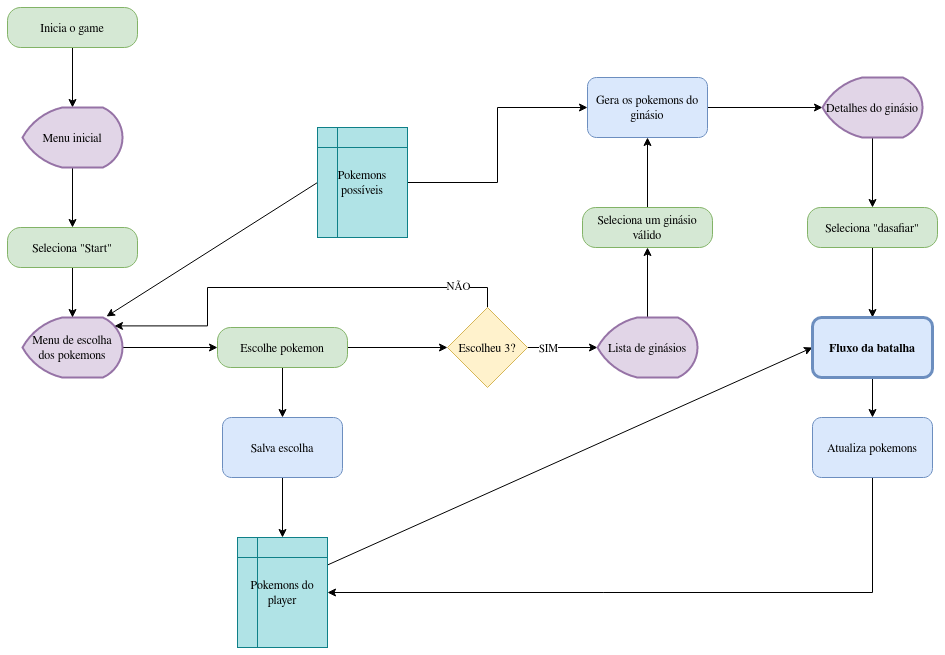
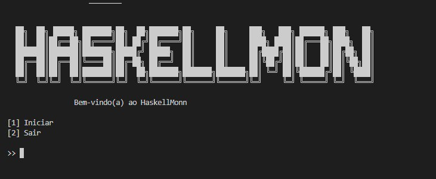
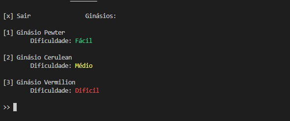
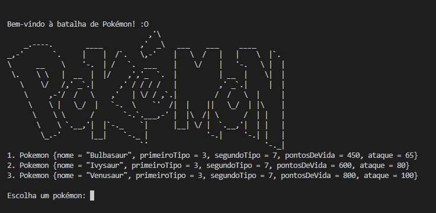
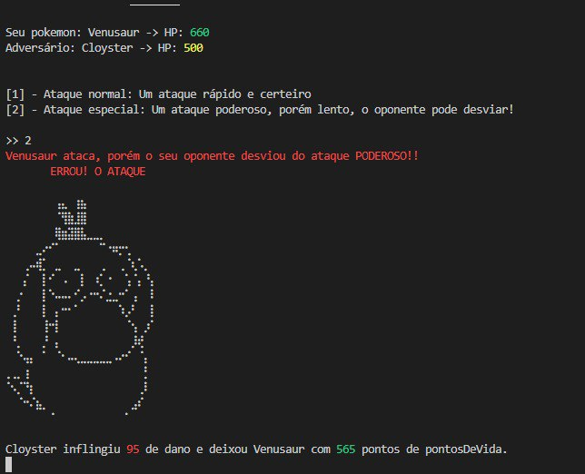
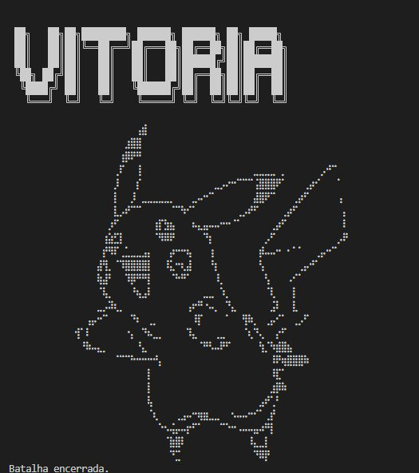

<!--# RepositorioTemplate
Esse repositório é para ser utilizado pelos grupos como um template inicial, da home page do Projeto.
As seções do Template NÃO DEVEM SER OMITIDAS, sendo TODAS RELEVANTES.

**!! *Atenção: Renomeie o seu repositório para (Ano.Semestre)_(Grupo)_(Paradigma)_(NomeDoProjeto)*. !!** 

Paradigmas:
 - Funcional
 - Logico
 - SMA

**!! *Não coloque os nomes dos alunos no título do repositório*. !!**

**!! *Exemplo de título correto: 2022.2_G1_Logico_ProjetoRoteirosAereos*. !!**
 
 (Apague esses comentários)-->

# HaskellMon

**Disciplina**: FGA0210 - PARADIGMAS DE PROGRAMAÇÃO - T01  
**Nro do Grupo**: 03 
**Paradigma**: Funcional 

## Alunos
| Matrícula | Aluno |
| :-: | -- |
|18/0030264|Antonio Igor Carvalho|
|18/0098021|Antonio Rangel Chaves|
|18/0149687|Daniel Porto de Souza|
|18/0042238|João Gabriel de Campos de Matos|
|18/0124498|Kess Jhones Gomes Tavares|
|18/0024868|Mateus Moreira Lima|
|18/0132385|Vitor Diniz Pagani Vieira Ribeiro|
|18/0145363|Yan Andrade de Sena|
|18/0078640|Yuri Alves bacarias|

## Sobre 

Uma aventura Pokémon.

O HaskellMon é um minigame simples de batalha Pokémon. 

Permite que o usuário escolha um ginásio para batalhar com seus defensores de forma interativa.

O usuário pode escolher um ginásio de acordo com a dificuldade, checar os pokémons defensores e desafia-los.

A batalha se dá de forma interativa onde o usuário escolhe entre usar um ataque básico, mais fraco e com mais chance de acerto, e um ataque poderoso, mais forte e mais lento, o que permite o adversário desviar.

A aplicação segue o seguinte fluxograma:

## Screenshots

## Instalação 
**Linguagens**: Haskell 
**Tecnologias**: GHC, Cabal, Docker, Make 
<!--Descreva os pré-requisitos para rodar o seu projeto e os comandos necessários.
Insira um manual ou um script para auxiliar ainda mais.
Gifs animados e outras ilustrações são bem-vindos!-->

Para clonar o repositório:

> $ git clone https://github.com/UnBParadigmas2023-1/2023.1_G3_Funcional_HaskellMon.git

Na pasta do repositório:

> $ make build

> $ make run

ou

> $ make build_run

## Uso 

O jogo é realizado por meio de comandos no terminal. Dessa forma, apenas siga as instruções disponíveis nos menus interativos para seguir o fluxo do game, selecionando as opções de interesse conforme a listagem indexada na tela.

## Vídeo

Link para vídeo de apresentação: https://youtu.be/iTfxtaZ8nqw

## Participações
Apresente, brevemente, como cada membro do grupo contribuiu para o projeto.
|Nome do Membro | Contribuição | Significância da Contribuição para o Projeto (Excelente/Boa/Regular/Ruim/Nula) |
| -- | -- | -- |
| Antonio Igor Carvalho      | Criação da lógica de batalha juntamente com Mateus, contribuição na junção dos módulos | Boa |
| Antonio Rangel Chaves      |  Criação do menu inicial, ajuda na parte de preparação para a batalha e mensagens de vitória e derrota | Regular |
| Daniel Porto de Souza | Idealização do projeto, implementação e evolução do módulo pre-battle, definição das estruturas structs, estruturação do projeto, ajustes e melhoramentos nas interfaces e apoio na integração final | Excelente |
| Kess Jhones Gomes Tavares  |  Ajuda na criação do menu inicial, ajuda na criação dos ginásios e separação dos pokemons     | Boa |
| João Gabriel de Campos de Matos |  Contribui principalmente na parte de criação de ginasio (modulo pre-battle), e na integração dela com outras partes | Boa |
| Mateus Moreira Lima |  Contribui juntamente com o Antonio na criação da lógica de batalha dos pokémons, e ajudei na integração do módulo de batalha com os outros módulos. | Boa |
| Vitor Diniz Pagani Vieira Ribeiro |  Contribui na parte de menu inicial, preparação para a batalha e na resolução do módulo main. | Boa |
| Yan Andrade de Sena  |  Ajuda na criação da lista de Pokemons disponibilizados e separando os pokemons por evolução     | Regular |
| Yuri Alves Bacarias  |  Trabalhei na parte de preenchimento de ginasio (pre-batle), com a adição da random, balancemante de pokemons e na integração com outros modulos     | Regular |

## Outros 

Infelizmente o fluxograma modelado pela equipe não foi concluido inteiramente, faltando a parte de escolha dos pokemons iníciais.

A atividade serviu de forma a contribuir muito e agregar muito valor na aquisição e consolidação dos conhecimentos estudados na disciplina sobre o módulo em questão. Uma verdadeira quebra de paradigma no que diz respeito a uma nova forma de se pensar a implemtação.

Acreditamos que esse simples game realiza bem o seu objetivo tendo algumas fragilidades como fixação dos pokemons iniciais e a não evolução dos mesmos. Fragilidades tais que podem servir de inspiração para implemetações futuras.

## Fontes
> https://www.haskell.org/documentation/

> https://emojicombos.com/pokemon-ascii-art

> https://patorjk.com/software/taag/#p=testall&f=ANSI%20Shadow&t=HASKELLMON

> https://www.pokemon.com/br/pokedex/
